# 📱 Dast e Khair – Donation App  

Dast e Khair is an innovative **mobile application** designed to connect **donors** and **recipients** efficiently.  
It streamlines the donation process by allowing donors to list available items and enabling recipients to claim what they need.  

The app focuses on making charitable contributions **seamless, accessible, and trustworthy** — encouraging a culture of giving in the community.  

---

## ✨ Features   

✅ **User Registration & Login** – Secure signup and login process for donors, recipients, riders, and NGOs.  

✅ **Upload Donations** – Donors can upload donations in **three categories** (Food, Clothes, Education) through simple, guided donation forms and attach images for better clarity.  

✅ **Item Claiming** – Recipients can browse available donations, claim items that match their needs, and view claim status in real time.  

✅ **Profile Matching** – Smart suggestions based on user profile and stated needs, making the process faster and more relevant.  

✅ **Donation History** – Donors and recipients can track past donations, claims, and deliveries.  

✅ **Rider Delivery & Navigation** – Riders get assigned deliveries, view pickup/drop-off locations, and navigate using **Google Maps API integration** for accurate routing.  

✅ **Pickup Scheduling** – Donors, recipients, and riders can coordinate pickup times and delivery schedules seamlessly.  

✅ **Notifications** – Real-time alerts for new listings, claim approvals, status updates, and upcoming deliveries.  

✅ **Khair Points** – Reward points for donors, encouraging continuous participation and fostering a culture of generosity.  

✅ **Feedback System** – Recipients can provide feedback on received items, helping maintain transparency and trust.  

✅ **NGO Campaign Uploads** – NGOs can create and publish donation campaigns directly on the platform, allowing donors to contribute specifically to causes they care about.  

✅ **Admin Panel** – Comprehensive web-based panel to approve users, manage campaigns, review listings, and monitor overall platform activity.  

---

## 🛠️ Tech Stack  

| Layer          | Technology Used |
|---------------|----------------|
| **Mobile App** | React Native (Expo) |
| **Admin Panel** | Next.js / Web Framework |
| **Backend** | Node.js + Express |
| **Database** | MySQL & Firebase |
| **UI Design** | Material Design |
| **Deployment** | Local (WAMP) + Nodemon for backend |

---

## 🚀 Getting Started  

Follow these steps to set up the project locally:  

### 1️⃣ Clone the Repository  

```bash
git clone https://github.com/21F-9108/DonationApp.git
cd DonationApp
```
### 2️⃣ Install Dependencies
```bash
npm install
```
### 3️⃣ Run the Mobile App
```bash

npx expo start
```
## 🖥️ Backend Setup
Ensure WAMP services (Apache & MySQL) are running on your PC.

```bash

# Change to backend directory
cd my-backend


# Install backend dependencies
npm install


#Start backend server
nodemon index.js
```
## 📸 Screenshots  

Here’s a quick look at **Dast e Khair** in action:  
#### These are SOME of the many screens. 
#### All screens are multilingual (English or Urdu) depending on user's choice of language.

---

### 🔑 Authentication Flow  
<p align="center">
  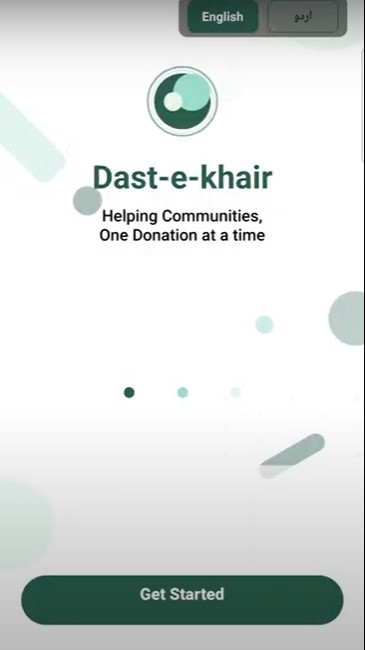
  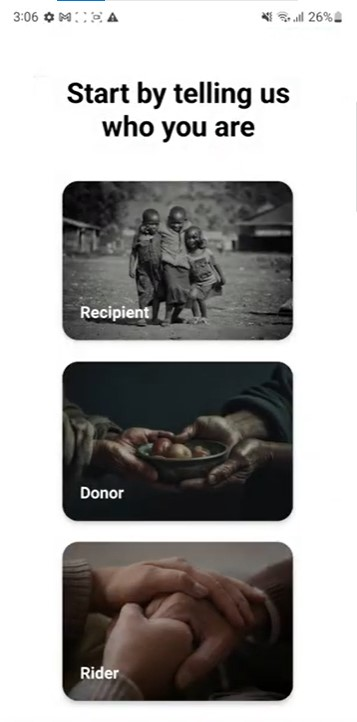
  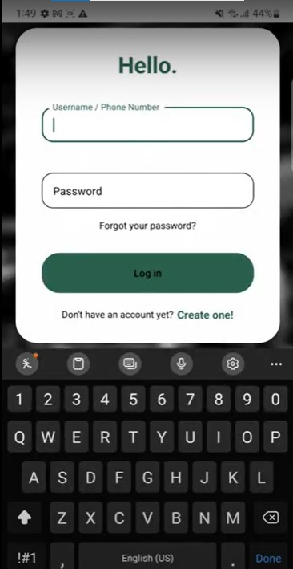
  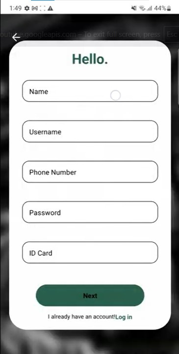
  
  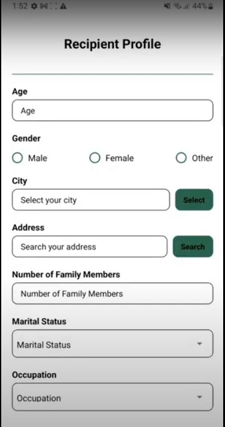

</p>

---

### 🏠 Home Screens  
<p align="center">
  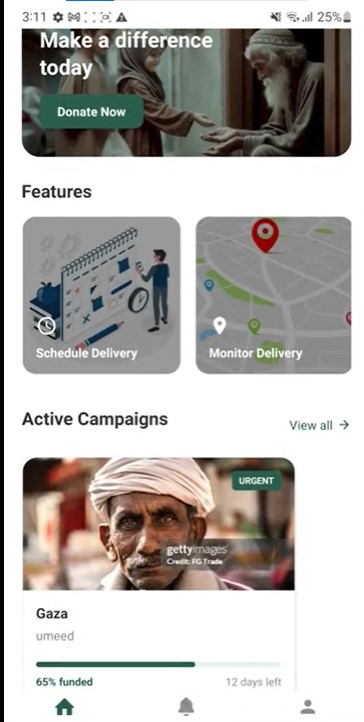
  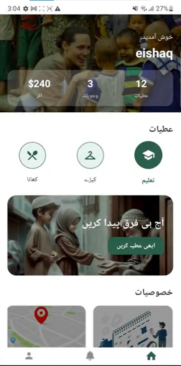
  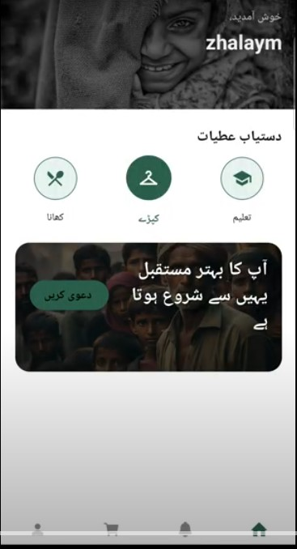
  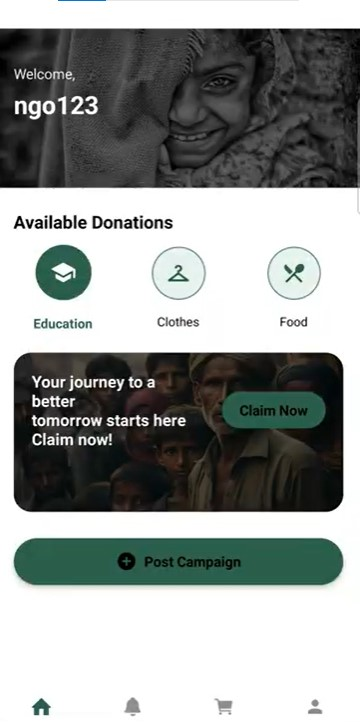
</p>

---

### 🎁 Donation Flow  
<p align="center">
  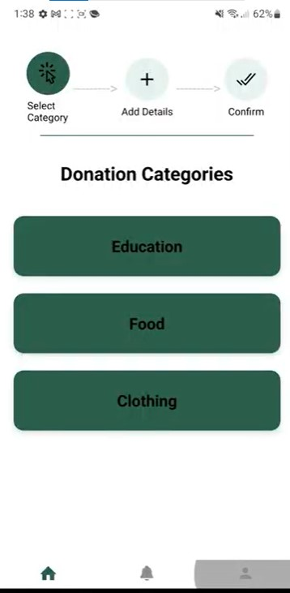
  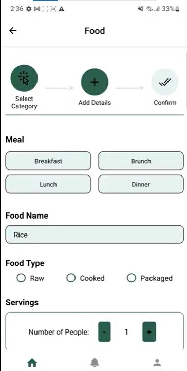
  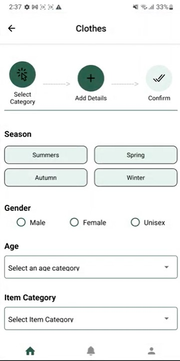
  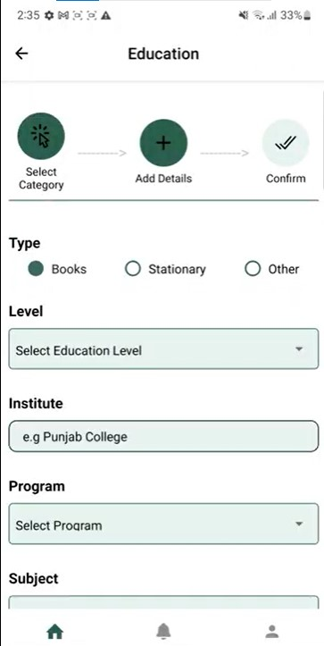
  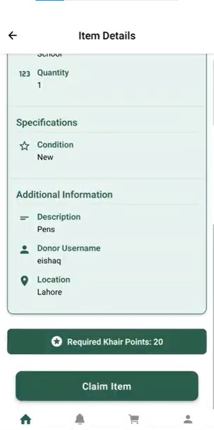
</p>

---

### ✅ Claim & Confirmation  
<p align="center">
  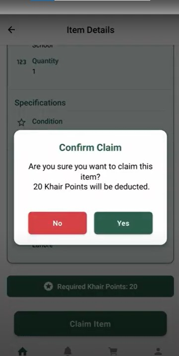
  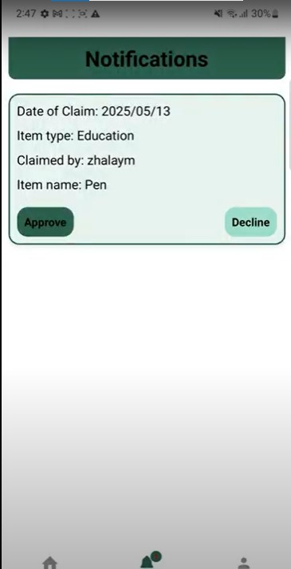
  
</p>

---

### 🚚 Pickup & Delivery  
<p align="center">
  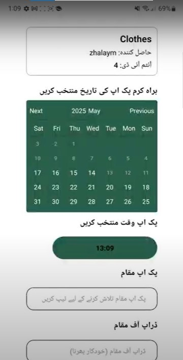
  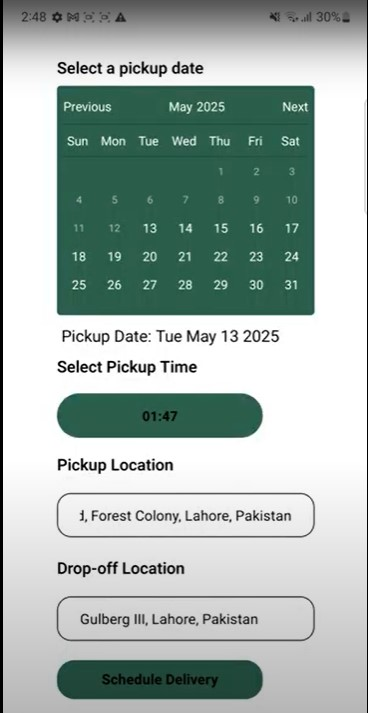
  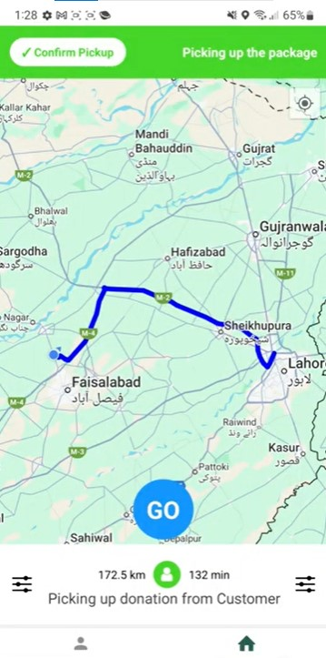
  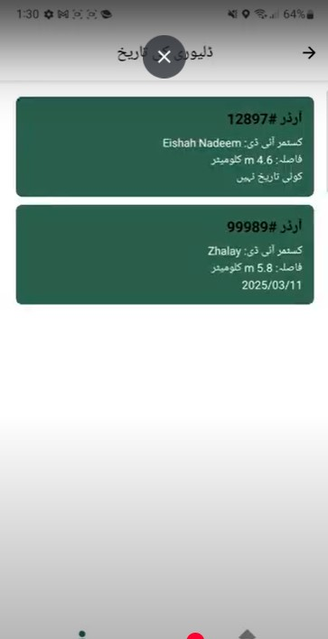
</p>

---

### 💬 Feedback & Forms  
<p align="center">
  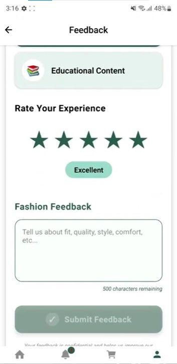
</p>

## 🌟 Why Dast e Khair?
Seamless Experience: User-friendly design and efficient workflows.

Community Impact: Encourages charitable giving with Khair Points.

Scalable Architecture: Built with React Native & Node.js for cross-platform growth.

---

## 📄 License

This project is licensed under the **MIT License** – you are welcome to use and modify this code to build your own donation platform, provided you include attribution to the original author.  
See the [LICENSE](./LICENSE) file for the complete text.


